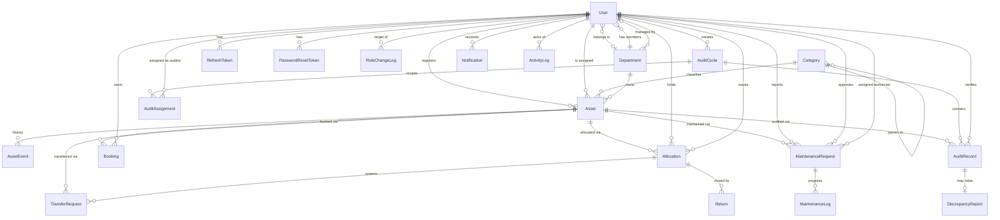
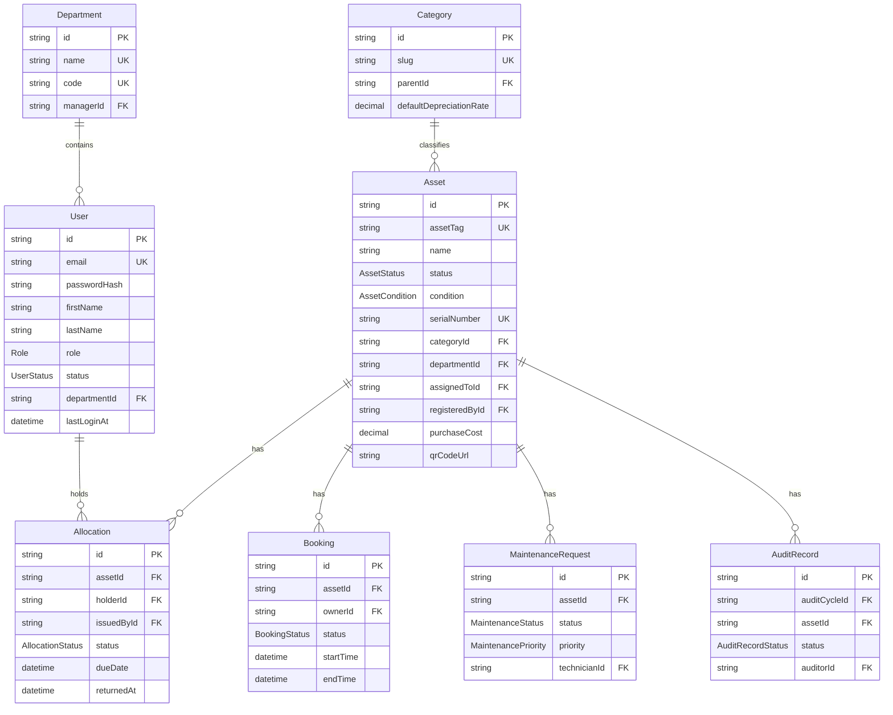

# 02 — Entity Relationship Diagram

Rendered from the authoritative `apps/api/prisma/schema.prisma`. View on any
Mermaid-capable renderer (GitHub, VS Code Mermaid preview).

## 2.1 Full ER diagram

## 2.2 Core entities (fields abbreviated)

## 2.3 Relationship notes

- **Asset ↔ Allocation** is one-to-many historically, but a DB partial unique
  index enforces **at most one `ACTIVE` allocation per asset**. `Asset.assignedToId`
  is a denormalized cache of the current holder for fast "my assets" queries.
- **Category** is a self-referential tree (`parentId`) enabling
  `IT › Laptops › Ultrabooks`.
- **AssetEvent** is an append-only ledger — never updated or deleted — giving a
  complete, tamper-evident asset history.
- **AuditRecord** is unique per `(auditCycleId, assetId)`: one verification line
  per asset per cycle. A `DiscrepancyReport` is a 1:1 optional child raised only
  when the observed state diverges from the record.
- Actor foreign keys (registeredBy, issuedBy, approver…) use `RESTRICT`/`SetNull`
  to preserve audit trails even if a user is later deactivated.
