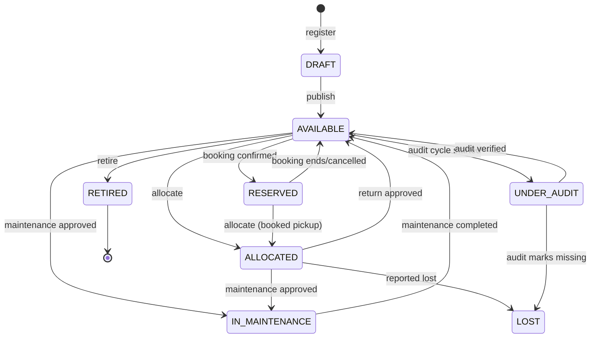
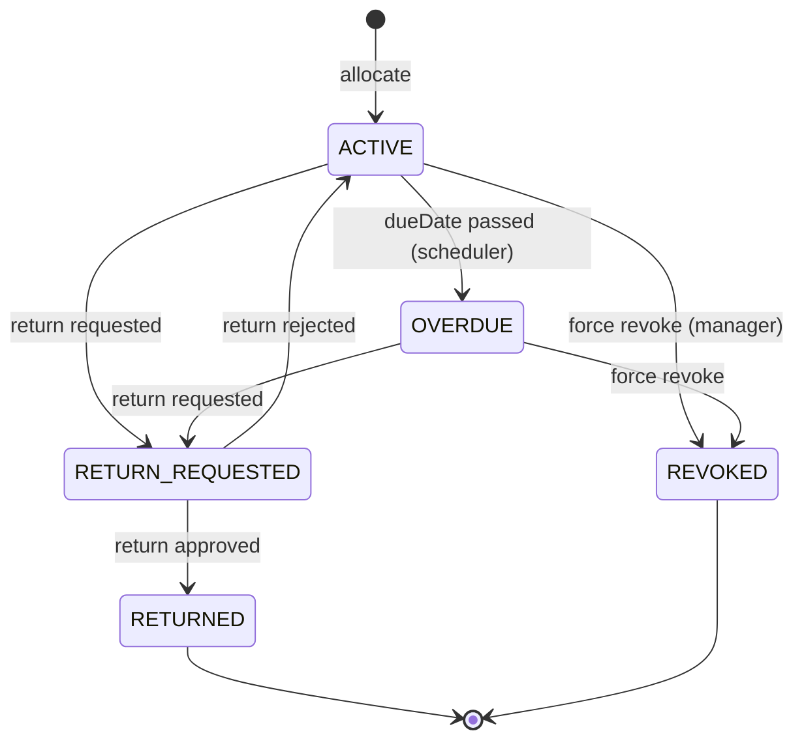
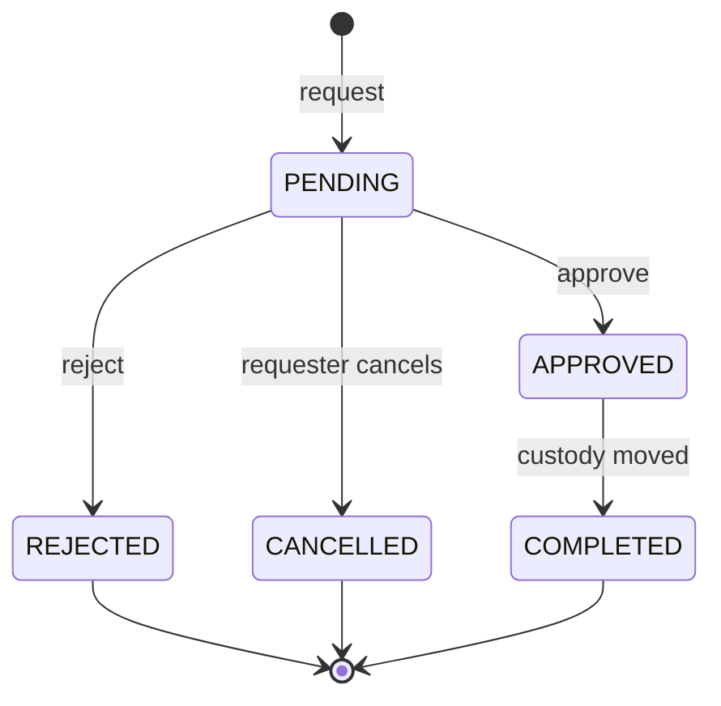
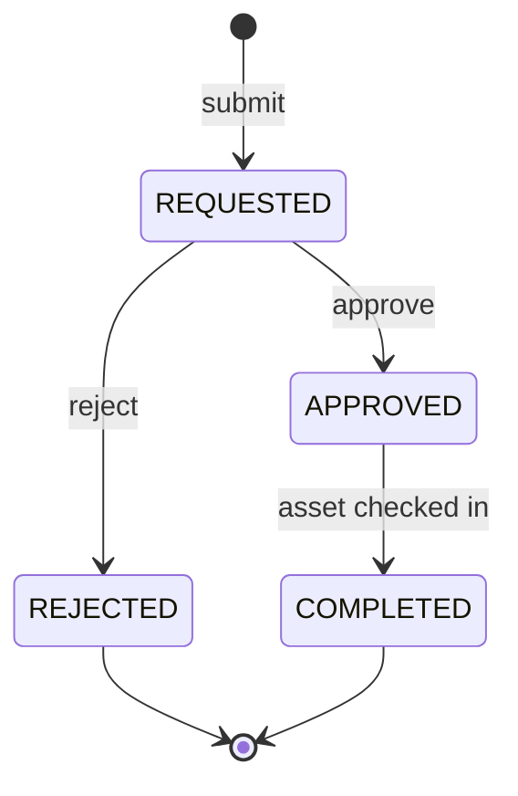
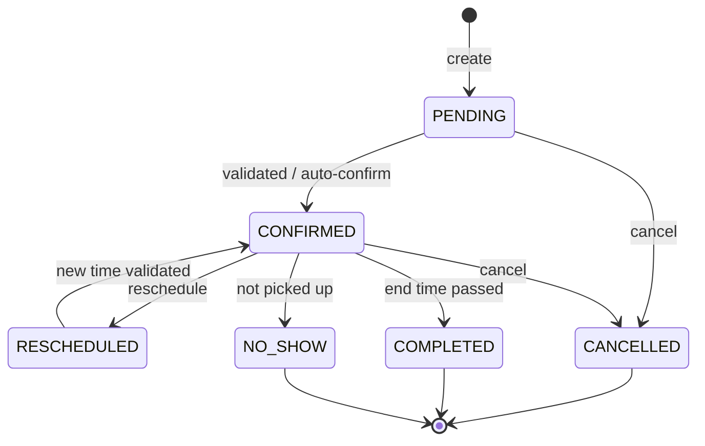
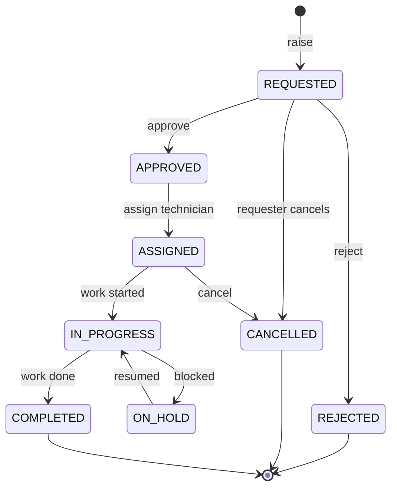
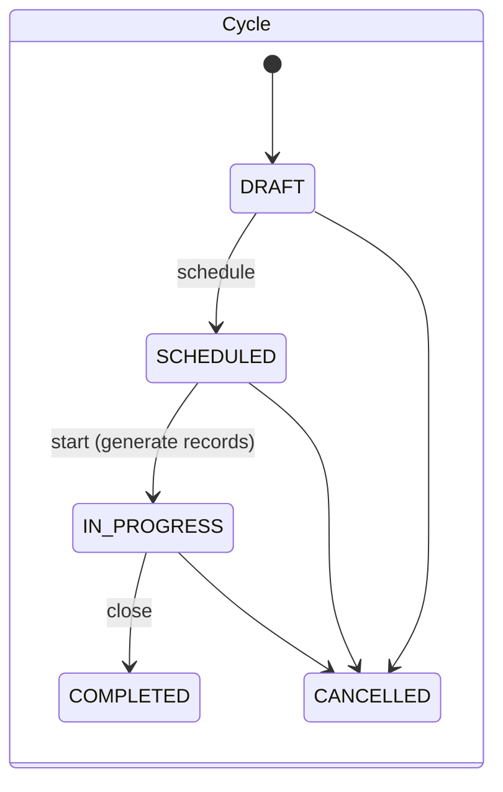
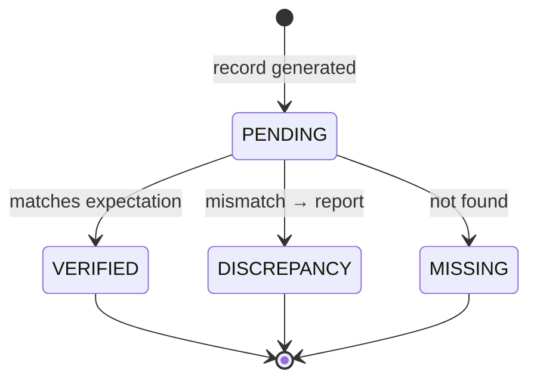
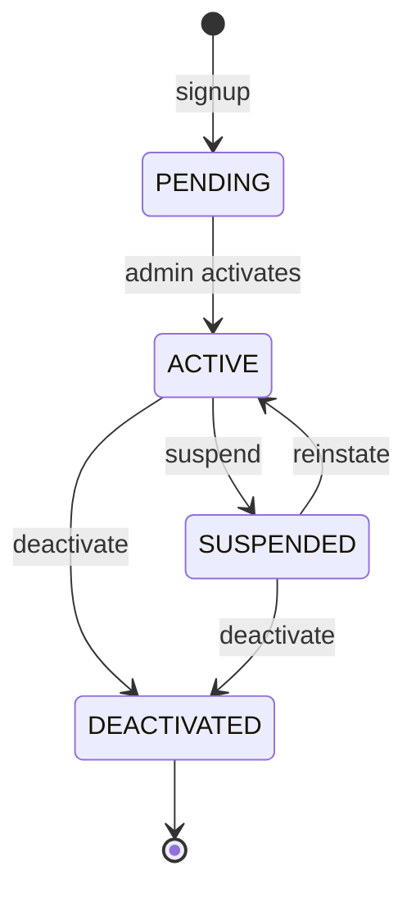

# 06 — State Machines

Every status-bearing entity moves only along explicitly allowed transitions.
Each module ships a `transitions.ts` guard (a `Record<FromState, ToState[]>`)
that the service consults before any status write; an illegal move throws
`AppError.invalidTransition()` → HTTP 409 `INVALID_STATE_TRANSITION`. This is
what makes the workflows tamper-resistant and idempotent.

## 6.1 Asset lifecycle (`AssetStatus`)

| From | Allowed to |
| --- | --- |
| DRAFT | AVAILABLE |
| AVAILABLE | RESERVED, ALLOCATED, IN_MAINTENANCE, UNDER_AUDIT, RETIRED |
| RESERVED | AVAILABLE, ALLOCATED |
| ALLOCATED | AVAILABLE, IN_MAINTENANCE, LOST |
| IN_MAINTENANCE | AVAILABLE |
| UNDER_AUDIT | AVAILABLE, LOST |
| RETIRED / LOST | *(terminal)* |

Every transition appends an `AssetEvent(STATUS_CHANGED, fromStatus, toStatus)`.

## 6.2 Allocation (`AllocationStatus`)

| From | Allowed to |
| --- | --- |
| ACTIVE | RETURN_REQUESTED, OVERDUE, REVOKED |
| OVERDUE | RETURN_REQUESTED, REVOKED |
| RETURN_REQUESTED | RETURNED, ACTIVE |
| RETURNED / REVOKED | *(terminal)* |

Invariant: at most one `ACTIVE` allocation per asset (partial unique index).

## 6.3 Transfer request (`TransferStatus`)

| From | Allowed to |
| --- | --- |
| PENDING | APPROVED, REJECTED, CANCELLED |
| APPROVED | COMPLETED |
| REJECTED / CANCELLED / COMPLETED | *(terminal)* |

Approval runs in a transaction: close the old allocation, open a new `ACTIVE`
one for `toUser`, update `asset.assignedToId`, append `AssetEvent(TRANSFERRED)`.

## 6.4 Return (`ReturnStatus`)

| From | Allowed to |
| --- | --- |
| REQUESTED | APPROVED, REJECTED |
| APPROVED | COMPLETED |
| REJECTED / COMPLETED | *(terminal)* |

Completion sets allocation → `RETURNED`, asset → `AVAILABLE` (or
`IN_MAINTENANCE` if returned `DAMAGED`), and records the reported condition.

## 6.5 Booking (`BookingStatus`)

| From | Allowed to |
| --- | --- |
| PENDING | CONFIRMED, CANCELLED |
| CONFIRMED | RESCHEDULED, CANCELLED, COMPLETED, NO_SHOW |
| RESCHEDULED | CONFIRMED, CANCELLED |
| CANCELLED / COMPLETED / NO_SHOW | *(terminal)* |

Create and reschedule both run overlap validation against
`PENDING|CONFIRMED|RESCHEDULED` bookings for the same asset.

## 6.6 Maintenance request (`MaintenanceStatus`)

| From | Allowed to |
| --- | --- |
| REQUESTED | APPROVED, REJECTED, CANCELLED |
| APPROVED | ASSIGNED, CANCELLED |
| ASSIGNED | IN_PROGRESS, CANCELLED |
| IN_PROGRESS | ON_HOLD, COMPLETED |
| ON_HOLD | IN_PROGRESS |
| REJECTED / CANCELLED / COMPLETED | *(terminal)* |

**Asset-status automation:** entering `IN_PROGRESS` drives the asset to
`IN_MAINTENANCE`; `COMPLETED` returns it to `AVAILABLE`. Each step appends a
`MaintenanceLog` and `AssetEvent`.

## 6.7 Audit cycle (`AuditCycleStatus`) & record (`AuditRecordStatus`)

| Cycle from | Allowed to |
| --- | --- |
| DRAFT | SCHEDULED, CANCELLED |
| SCHEDULED | IN_PROGRESS, CANCELLED |
| IN_PROGRESS | COMPLETED, CANCELLED |
| COMPLETED / CANCELLED | *(terminal)* |

| Record from | Allowed to |
| --- | --- |
| PENDING | VERIFIED, DISCREPANCY, MISSING |
| VERIFIED / DISCREPANCY / MISSING | *(terminal within cycle)* |

Starting a cycle sets in-scope assets → `UNDER_AUDIT`; `VERIFIED`/closing
returns them to their prior status; `MISSING` transitions the asset → `LOST`.
`DISCREPANCY` creates a `DiscrepancyReport` child.

## 6.8 User account (`UserStatus`)

| From | Allowed to |
| --- | --- |
| PENDING | ACTIVE |
| ACTIVE | SUSPENDED, DEACTIVATED |
| SUSPENDED | ACTIVE, DEACTIVATED |
| DEACTIVATED | *(terminal)* |

Only `ACTIVE` users may authenticate; login checks status and returns
`AUTH_ACCOUNT_INACTIVE` otherwise.
